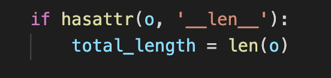
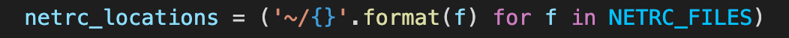
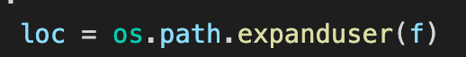
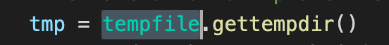
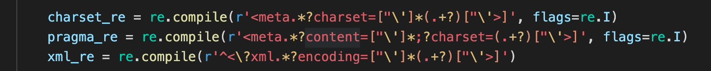

# 3 utils.py

## 代码风格

有很多 Pythonic 的写法可以学习

## 重点剖析

**len**在 len()的时候生效。

这是一种非常 Pythonic 的写法。注意，这里生成的是一个 generator 类型的对象。可以用 for 遍历。

这里的 expanduser 是用来取代路径里的～/～ user，获取真实路径的。

这里是一种可选是否要 raise error 的方法。raise_errors 通过函数参数注入（默认为 False）。如果显式注入 True，则 raise 这个 exception。 注意：这里 raise 不带参数的用法是 raise 最近 raise 过的一个 Exception。详见[raise 无参数](https://stackoverflow.com/questions/3228591/python-rasing-an-exception-without-arguments)

一个很好用的创建临时文件的方法，用完即删，而且不用担心 race condition。

很 Pythonic 的写法，意思是把 member 用‘/’隔开，然后作为一组参数传入 join 中。

注意: 对于字符串来说, item[-1]和 item[-1:]的含义是一样的，但对于数组来说，item[-1]等于最后一个对象，item[-1:]等于把最后一个对象取出来，构造成 list。

这些正则你都知道含义吗？正则表达式 FYI：

