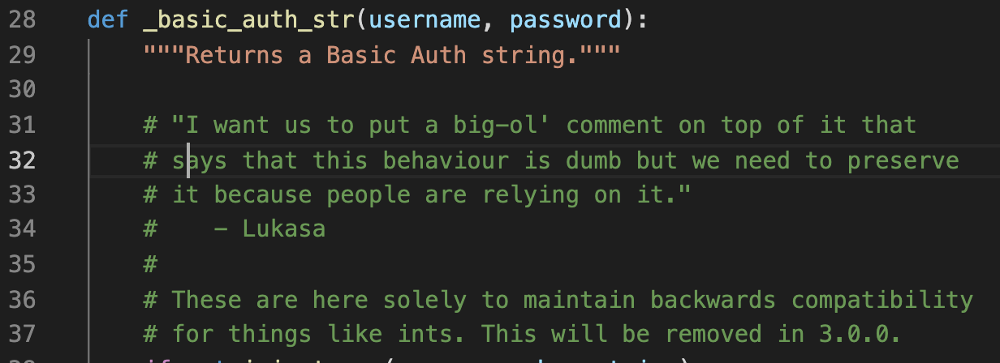
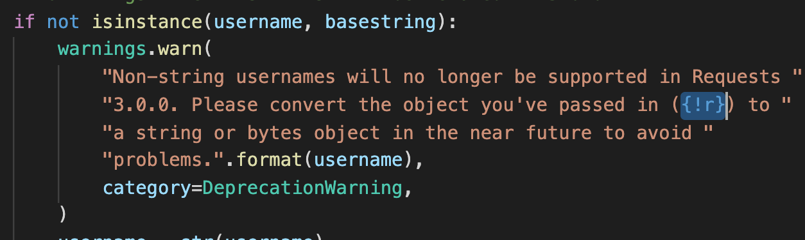
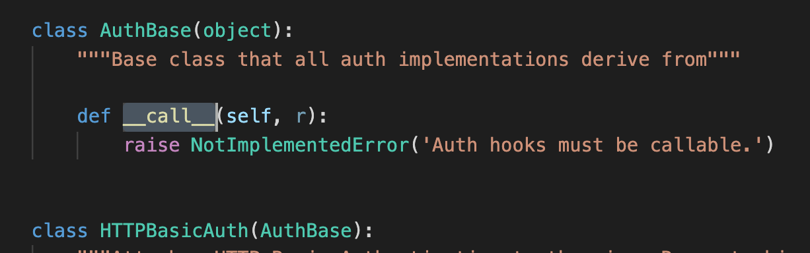
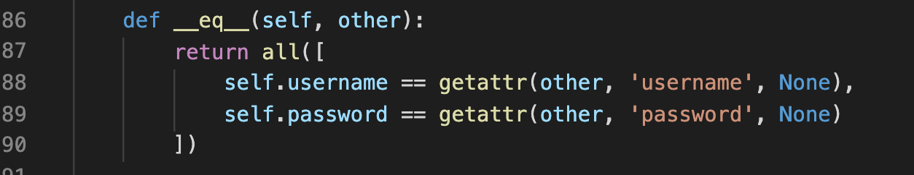
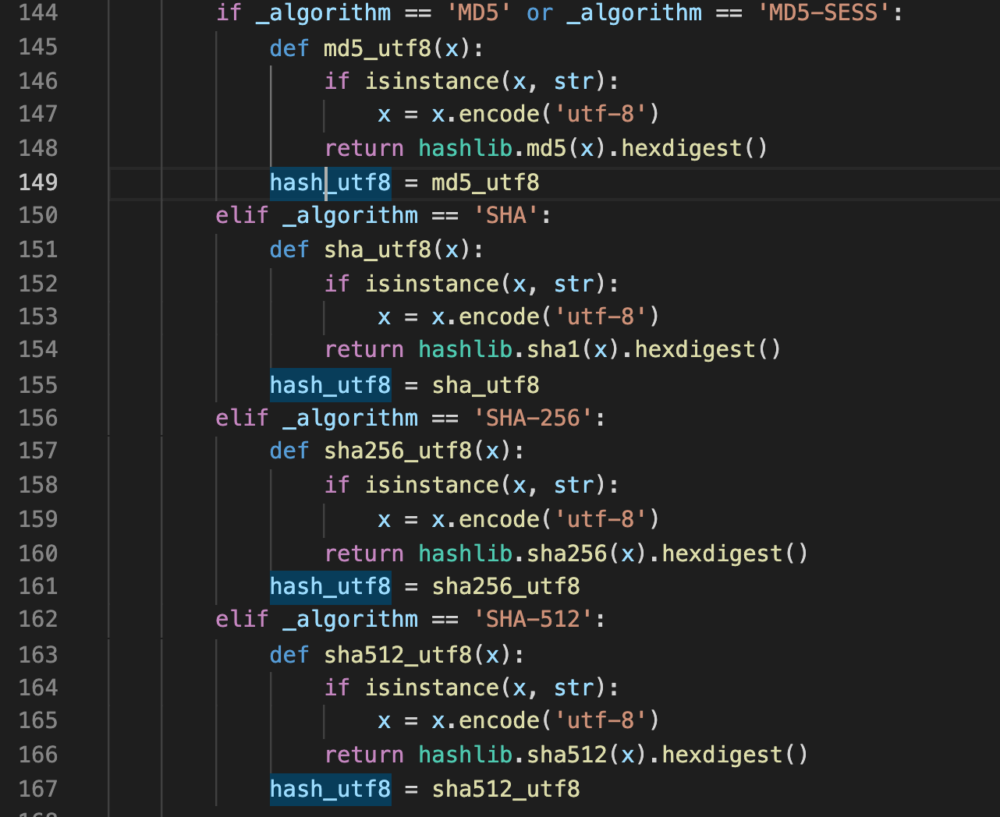

# 4 auth.py

## 代码风格

简洁明快。注释清楚得当。读起来不费劲。

## 重点剖析

开头的注释依然很清楚，注明了函数存在的用意。

注意这里`{!r}.format()`的意思是调用**repr**: returns a printable representation of the given object。[**str**和**repr**的异同](https://stackoverflow.com/questions/1436703/what-is-the-difference-between-str-and-repr)

这里写 HTTPAuth 前写 AuthBase 作为基类，方便日后扩展和避免重复代码。好评！ [**call**的含义](https://blog.csdn.net/Yaokai_AssultMaster/article/details/70256621)

**eq**判定相等的意思。这里 all()是判断 iterable 里的内容是不是都为 True。

这里使用 Pythonic 的方式定义函数，很妙！

Pythonic 的变量写法。

## 总结

本节是对 BA 验证具体逻辑的实现。逻辑方面较为复杂，但依然有代码规范上的学习空间。如有深入学习逻辑的需要，可以再挖掘。个人觉得得益于项目良好的代码习惯，难度不会太大。
