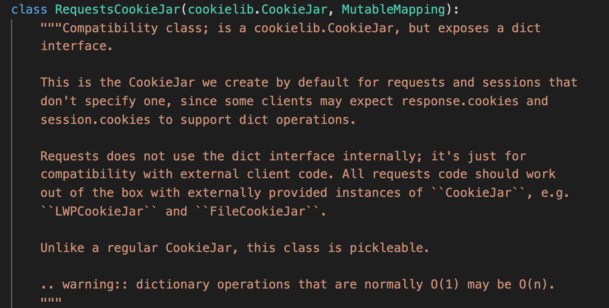
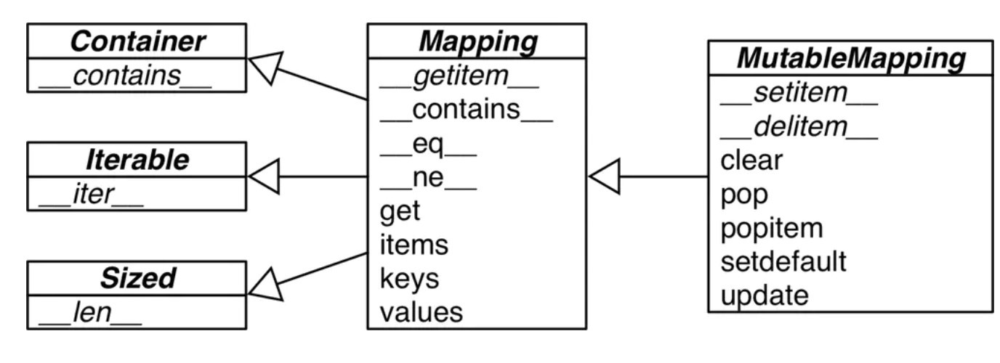
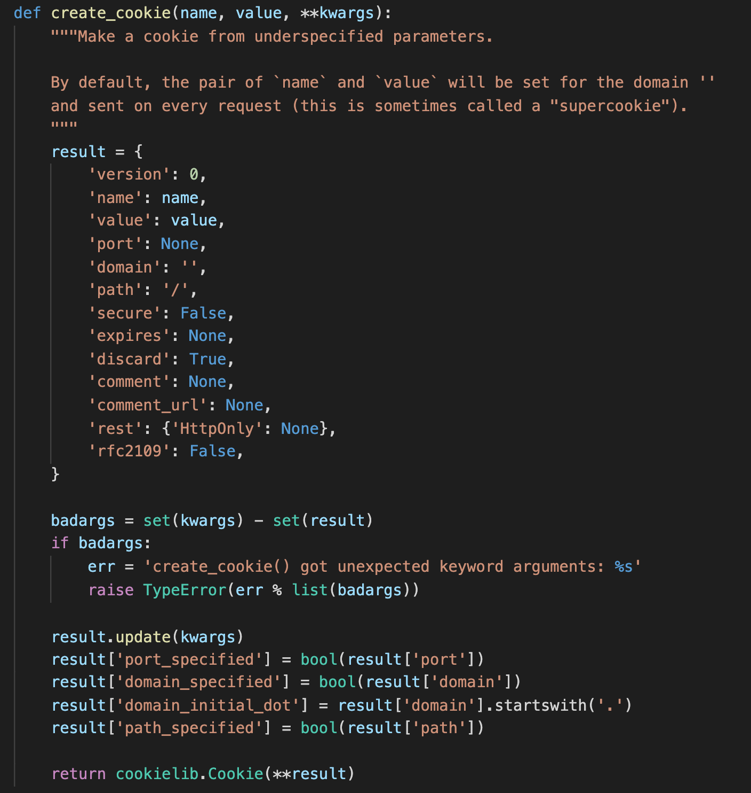
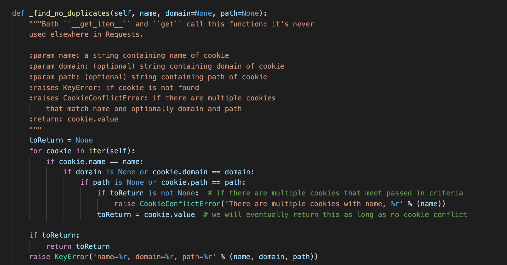
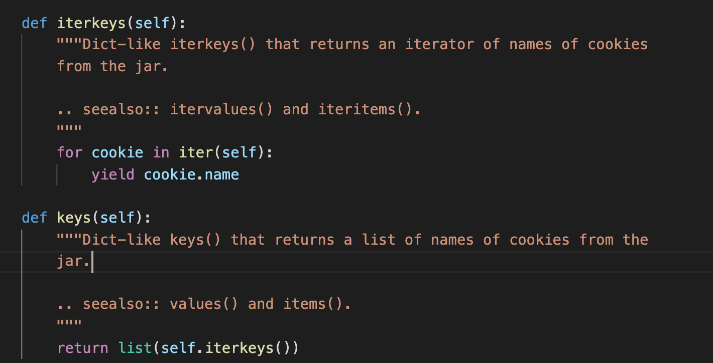

# 5 cookie.py

## 代码风格

本页代码比较简单。但依然存在一些代码风格上的特点。

## 重点剖析

注意此处 RequestsCookieJar 重写了 dict，但他并没有直接重写 dict，而是继承了 MutableMapping。这是为了重写 Dict 而使用的。[dict 的继承关系](https://stackoverflow.com/questions/1436703/what-is-the-difference-between-str-and-repr)

这里构造 dict 的方式很巧妙。dict.update()更新字典，很妙！

这里的代码我觉得写的很好。根据多条件判断有没有重复的 name。 上面的注释的方式也写的很不错！告诉了哪里使用了这些代码，以及参数的含义是什么。

巧用构造器，很 Pythonic！

## 总结

继承了代码一贯上的简洁风格。读起来不费力。巧妙利用了继承特性。Exception 调用了原生的同时，做了适当扩展延伸。
