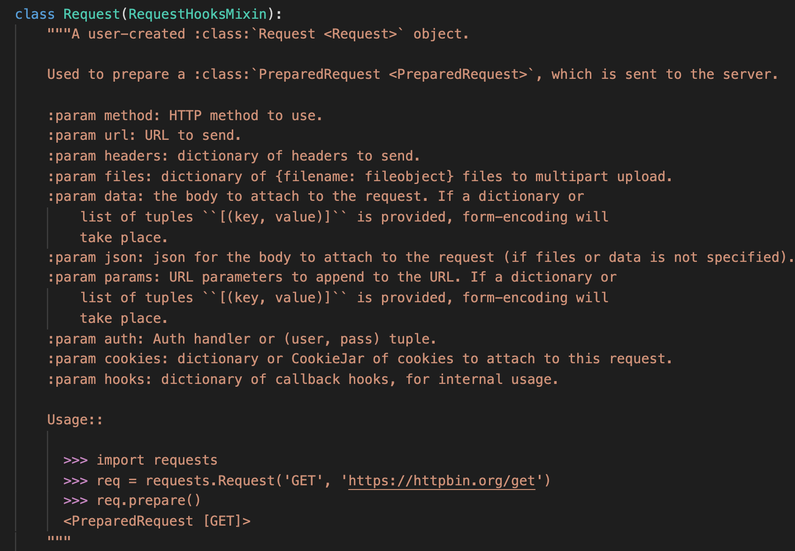
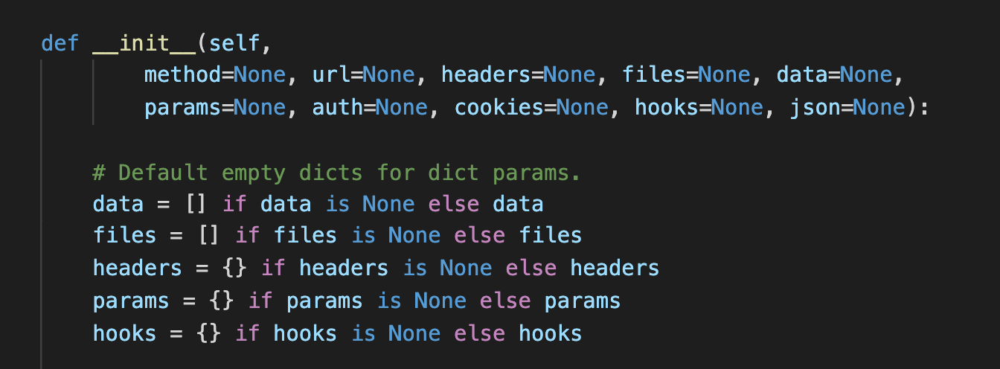
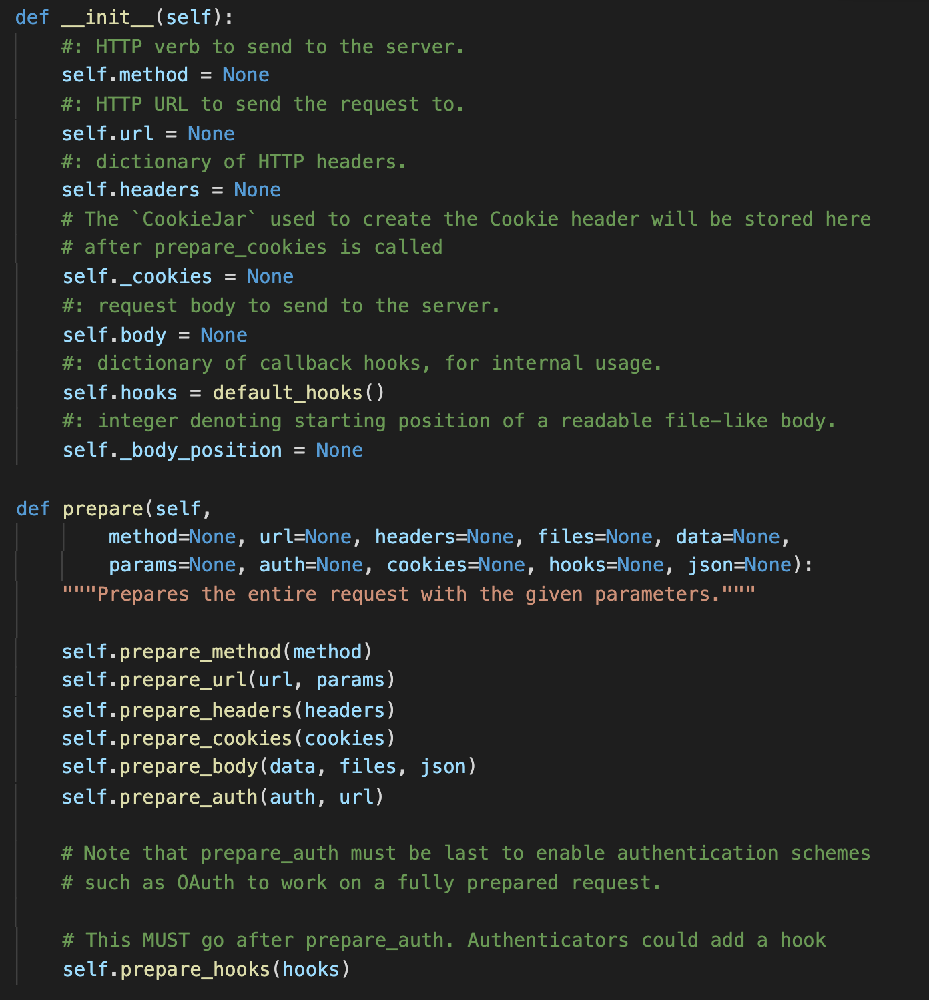
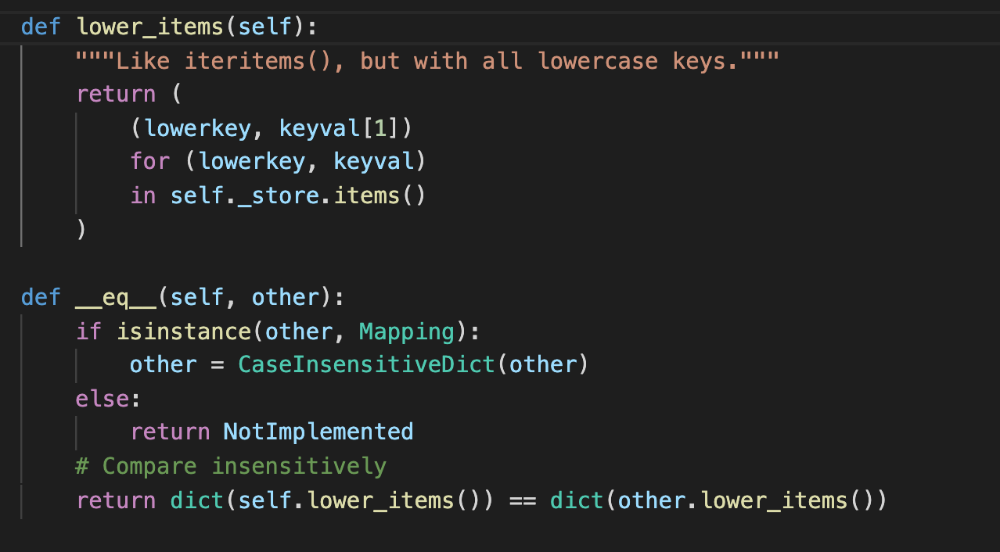
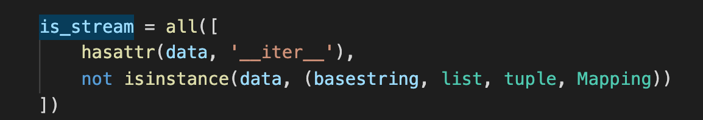
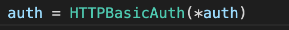

# 6 model.py

## 1. 代码风格

本页代码本质上是构造 resquest 和 response 对象的过程。运用了很多 Pythonic 的写法。主要的 http 连接逻辑在 adapters.py 中，调用了 Python 原装库，运用了线程池等相关知识。

## 2. 重点剖析

学习一下这里的注释的写法。介绍类型，作用。再加上 Param 的定义。最后描述用法。

注意这里的变量赋值！并没有让参数默认为[]或{}，而是设为 None，后续进行判断后赋值：可以防止传入 None！

可以学习这里参数赋初值（None），然后 prepare 方法详细构造值。

这里构造 dict 的方式非常巧妙。在 Python 中，dict([(,)])的方式可以构造字典！dict == dict 可以比较字典是否相等（比较内容，而非 Java 当中比较引用）。 **Python 中“is“才是比较引用。==是比较值。调用**eq**方法！** [is 和==在 python 中的区别](https://realpython.com/courses/python-is-identity-vs-equality/)

这里 all 的使用方式很妙，很 Pythonic。all()的作用是比较 iterable 是不是 bool(x)都是 True。这里 isinstance(,(,))也可学习，同时比较多种类型，等价于 or。

这里也是很 Pythonic 的传参方式！(*var)的含义是将 var 转成没有 key 的参数传入函数。比如 test=(1,2,3),`test=(1,2,3) print(*test)`的结果是 1 2 3。[参数加\*的含义](https://www.geeksforgeeks.org/python-star-or-asterisk-operator)

## 3. 总结

代码化繁为简。运用了 Pythonic 的写法让代码更简洁，更易读。非常合理的简化了复杂的逻辑。对于多态的应用也十分到位。自己开发时也应避免重复造轮子。面对定制化需求时，合理运用多态特性。
